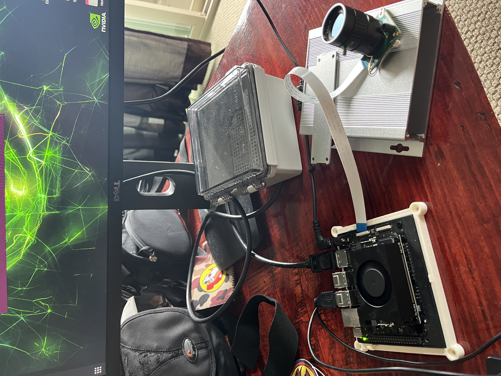
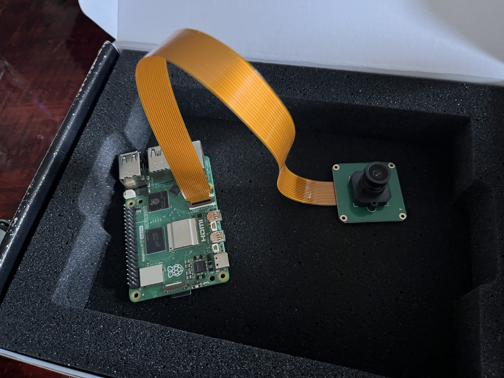

# Proxigo Scalence

Minimal setup-focused repository for a vision-first VPS baseline.

## Project Report
 Either Download from Repo, or Contact me. (Large 24MB File)
- [Proxigo Visual Positioning Report (HTML)](Proxigo_Scalence_Report_v8.html)

## Scope

- Primary runnable path: `scripts/vps_live.py`
- Primary reusable package: `src/vps_device/`
- Benchmark/repro guidance: use `scripts/vps_live.py` outputs and local CSV metrics.

Additional workflows and utilities exist in the repository beyond this default setup path.

## Minimal Setup

1) Install dependencies:

```bash
pip install opencv-python opencv-contrib-python numpy scikit-learn Pillow matplotlib
```

2) Prepare a reference region:

```bash
python scripts/prepare_region.py \
  --lat 36.23 --lon -116.81 \
  --radius-m 500 \
  --output-dir satellite_data/regions/my_region
```

3) Run VPS on video:

```bash
python scripts/vps_live.py \
  --source flight_recording.mp4 \
  --reference satellite_data/regions/my_region \
  --altitude 50 \
  --output-csv results.csv
```

## Notes

- This repository includes multiple workflows covering core VPS, benchmarking, and integration utilities.

## Physical Trial Devices

The software baseline is developed so it can be exercised on companion-compute hardware during physical trials.

<p align="center">
  
  
</p>

- **Orin Nano + camera rig (`OrinCameraDemo.JPG`)**
  - Primary trial hardware target for running the VPS pipeline on-device.
  - Used for camera capture, feature matching, and replay/live validation loops.
- **Raspberry Pi 5 setup (`Pi5.JPG`)**
  - Secondary platform for portability checks and lightweight compatibility testing.
  - Useful for validating deployment assumptions before full Orin/PX4 integration trials.

## Datasets Used

- **UAV-VisLoc (primary GT benchmark dataset)**
  - Used for deterministic replay benchmarking with ground-truth comparison.
  - Typical workflow: extract a section with `scripts/setup_uav_visloc.py`, then run `scripts/vps_live.py` with `--source-csv`.
- **AnyVisLoc / UAV-AVL-style layouts (secondary experimentation)**
  - Used for additional software-only benchmarking and retrieval/matching experiments.
  - Supports stress-testing map matching behavior under different map/scene conditions.

> **Citation**: Yuxuan Zhou et al., "UAV-VisLoc: A Large-scale Dataset for UAV Visual Localization," arXiv:2405.11936, 2024.

See [Testing with Video](docs/TESTING_WITH_VIDEO.md) for more details on pre-recorded testing.

---

## Project Structure

```
Proxigo_Scalence/
├── src/
│   ├── vps_device/              # Core VPS library (no ROS2 dependency)
│   │   ├── estimator.py         # VPSEstimator: image + altitude -> (lat, lon)
│   │   ├── features.py          # ORB extraction, FLANN matching, K-means filtering
│   │   ├── geo_transform.py     # Pixel <-> geographic coordinate conversion
│   │   ├── reference_loader.py  # Load satellite reference images + metadata
│   │   ├── config.py            # Camera FOV, resolution, matcher parameters
│   │   ├── continuity.py        # Cluster selection with position history
│   │   ├── simulation.py        # Synthetic view generation, trajectory simulation
│   │   └── vps_device_node.py   # ROS2 node wrapper
│   ├── proxigo_bringup/         # ROS2 launch files
│   ├── satellite_matching/      # ROS2 satellite matcher node
│   ├── state_fusion/            # VIO + satellite fusion EKF
│   └── vio_bridge/              # VIO interface, camera/IMU simulators
├── scripts/
│   ├── vps_live.py              # Standalone VPS runner (camera, video, or image dir)
│   ├── prepare_region.py        # Download satellite imagery for a region
│   ├── setup_uav_visloc.py      # Extract UAV-VisLoc test data from zip
│   └── vps_sim_web/             # Web-based VPS simulator (Flask + CesiumJS)
├── config/                      # Camera calibration, VIO params, mission config
├── docker/                      # Dockerfiles for Orin Nano deployment
├── satellite_data/              # Pre-downloaded satellite reference imagery
├── docs/                        # Architecture and design documentation
├── docker-compose.yml           # Production deployment (Orin Nano)
└── docker-compose.dev.yml       # Development / simulation
```

---

## VPS Algorithm (Current Baseline)

### Pipeline

1. **Feature Extraction** -- ORB keypoints and descriptors (configurable count, default 250) from both camera frame and satellite reference.
2. **Feature Matching** -- FLANN-based matching with Lowe's ratio test (threshold 0.95).
3. **Outlier Rejection** -- K-means clustering (6 clusters) on reference-image match coordinates. Select the cluster closest to the last known position. Discard matches far from the cluster median.
4. **Position Estimation** -- For each inlier match, convert the reference pixel to geographic coordinates, then offset by the camera pixel position relative to frame center. Take the median of all estimates.
5. **Continuity** -- The previous position estimate seeds the next cluster selection, providing frame-to-frame consistency without an IMU.

### Configuration

Key parameters in `VPSDeviceConfig`:

| Parameter | Default | Description |
|-----------|---------|-------------|
| `h_fov_deg` | 71.5 | Camera horizontal field of view |
| `d_fov_deg` | 79.5 | Camera diagonal field of view |
| `width_px` / `height_px` | 1920 / 1080 | Camera resolution |
| `nfeatures_orb` | 250 | ORB features to extract |
| `ratio_threshold` | 0.95 | Lowe's ratio test threshold |
| `n_clusters` | 6 | K-means clusters for outlier rejection |
| `min_matches` | 10 | Minimum matches to produce an estimate |

---

## Deployment on Orin Nano

### Direct Execution (Recommended for Initial Testing)

```bash
# SSH into Orin Nano
ssh nvidia@orin.local

# Copy project
scp -r Proxigo_Scalence/ nvidia@orin.local:~/

# Install dependencies (JetPack includes OpenCV and NumPy)
pip3 install scikit-learn Pillow

# Prepare reference data for your test area
python3 scripts/prepare_region.py \
    --lat YOUR_LAT --lon YOUR_LON --radius-m 500 \
    --output-dir ~/satellite_data/my_region

# Run VPS live
python3 scripts/vps_live.py \
    --source /dev/video0 \
    --reference ~/satellite_data/my_region \
    --altitude 50
```

### Docker Deployment (Full Stack)

```bash
./scripts/build_all.sh jetson
docker-compose up -d
```

### Deploy Script

```bash
./scripts/deploy_orin.sh orin.local nvidia
```

---

## ROS2 Integration

The VPS core library has no ROS2 dependency. For integration with the full ROS2 stack:

| Package | Description |
|---------|-------------|
| `vps_device` | VPS estimator node: subscribes to image + altitude, publishes position + confidence + debug image |
| `satellite_matching` | Satellite matcher with region management |
| `state_fusion` | EKF fusing VIO + satellite matches |
| `vio_bridge` | VIO interface, camera/IMU simulators |
| `proxigo_bringup` | Launch files for simulation and hardware |

```bash
# Build ROS2 packages
cd /ros2_ws && colcon build --symlink-install && source install/setup.bash

# Launch simulation
ros2 launch proxigo_bringup simulation.launch.py

# Launch on hardware (Orin Nano)
ros2 launch proxigo_bringup hardware.launch.py
```

---

## Roadmap

### Phase 1: Software Validation -- COMPLETE (software scope)
- [x] System architecture and documentation
- [x] ROS2 package structure
- [x] VPS estimator library (ORB + FLANN + K-means + geo-transform)
- [x] Satellite matching algorithm with continuity filtering
- [x] Web-based VPS simulator with trajectory simulation
- [x] State fusion EKF
- [x] PX4/MAVROS integration scaffolding

### Phase 2: Live Testing -- IN PROGRESS
- [x] Standalone VPS live runner (camera + video input)
- [x] Satellite reference preparation tool
- [x] Software-only IMU simulation path in fusion pipeline
- [x] Camera calibration on Orin Nano
- [x] Ground-level position accuracy testing
- [ ] First flight tests at 30-100m altitude
- [ ] Performance tuning (feature count, matching threshold)

### Scope Note

- This repository includes both baseline components and extended integration modules.

### Phase 3: VPS Hardware Module
- [ ] OpenVINS VIO integration
- [ ] IMU fusion for inter-frame odometry
- [ ] Standalone hardware enclosure design
- [ ] MAVLink VISION_POSITION_ESTIMATE output
- [ ] Custom carrier board

See [VPS Module Roadmap](docs/VPS_MODULE_ROADMAP.md) for the full hardware module plan.

---

## Documentation

These are the docs most tied to the current repo workflow (testing, calibration, and the standalone VPS package):

- [Testing with Video](docs/TESTING_WITH_VIDEO.md) -- Pre-recorded video and image sequence testing
- [VPS Device Module](docs/VPS_DEVICE_MODULE.md) -- Standalone `vps_device` Python package
- [Calibration Guide](docs/CALIBRATION_GUIDE.md)
- [VPS Module Roadmap](docs/VPS_MODULE_ROADMAP.md) -- Planned hardware module milestones

Additional material under `docs/` covers Docker-based simulation, PX4 / QGroundControl troubleshooting, VTOL and fixed-wing notes, and broader architecture.

---

## References

- [OpenVINS](https://github.com/rpng/open_vins) -- Visual-inertial navigation
- [PX4 Autopilot](https://px4.io/) -- Flight control
- [ROS2 Humble](https://docs.ros.org/en/humble/) -- Robot middleware
- [MAVROS2](https://github.com/mavlink/mavros) -- MAVLink bridge for ROS2

---

## License

MIT License. See [LICENSE](LICENSE) for details.
